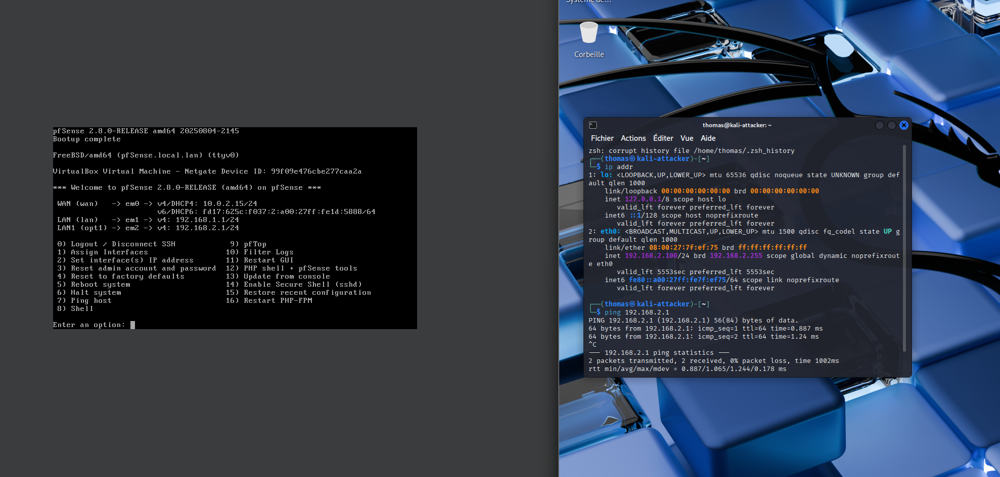

# Configuration réseau – pfSense (3 interfaces)

## pfSense (pare‑feu/routeur)

| Interface pfSense | Rôle | Type VirtualBox | Réseau | IP/Passerelle | DHCP |
|---|---|---|---|---|---|
| **em0** | **WAN Internet** | **NAT** | NAT | IP & GW fournies par VirtualBox (10.0.2.0/24 en général) | n/a |
| **em1** | **Lab_Red** | **Réseau interne → `Lab_Red`** | 10.10.10.0/24 (exemple) | pfSense **10.10.10.1/24** (GW pour Lab_Red) | optionnel |
| **em2** | **Lab_LAN** | **Réseau interne → `Lab_LAN`** | 192.168.100.0/24 (exemple) | pfSense **192.168.100.1/24** (GW pour Lab_LAN) | **activé** (p.ex. 192.168.100.10–200) |

> Adapte les plages si tu en utilises d’autres, mais **chaque réseau doit être unique**.

---

## Kali Linux (attaquant)

| NIC | Type VirtualBox | Réseau | IP suggérée | Passerelle |
|---|---|---|---|---|
| **eth0** | Réseau interne | **Lab_Red** | via DHCP pfSense ou statique **10.10.10.x/24** | **10.10.10.1** (pfSense em1) |
| **eth1 (optionnel)** | NAT | NAT (mises à jour) | auto | 10.0.2.2 (gateway NAT VB) |

---

## SELKS (IDS/IPS)

| NIC | Type VirtualBox | Réseau | IP | Passerelle |
|---|---|---|---|---|
| **eth0** | Réseau interne | **Lab_LAN** | **192.168.100.20/24** | **192.168.100.1** |
| **eth1 (optionnel)** | Réseau interne | **Lab_Red** | **10.10.10.20/24** | **10.10.10.1** |

*(Tu peux n’en mettre qu’un si tu préfères placer l’IDS côté LAN seulement.)*

---

## Windows Server (AD cible)

| NIC | Type VirtualBox | Réseau | IP | Passerelle | DNS |
|---|---|---|---|---|---|
| **Ethernet0** | Réseau interne | **Lab_LAN** | **192.168.100.50/24** | **192.168.100.1** | **192.168.100.1** (ou l’IP du DC plus tard) |

---

## Rappel câblage VirtualBox (important)

- **pfSense**
  - *Interface 1* → **NAT** (em0)
  - *Interface 2* → **Réseau interne `Lab_Red`** (em1)
  - *Interface 3* → **Réseau interne `Lab_LAN`** (em2)

- **Kali**  
  - *Interface 2* → **Réseau interne `Lab_Red`**  

- **Windows Server**  
  - *Interface 3* → **Réseau interne `Lab_LAN`**

- **SELKS**  
  - *Interface 3* → **Lab_LAN** 

---

## Ping de test

